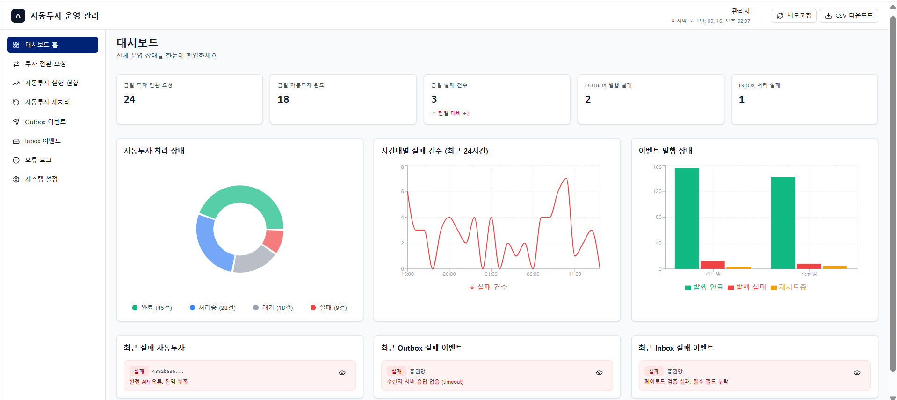
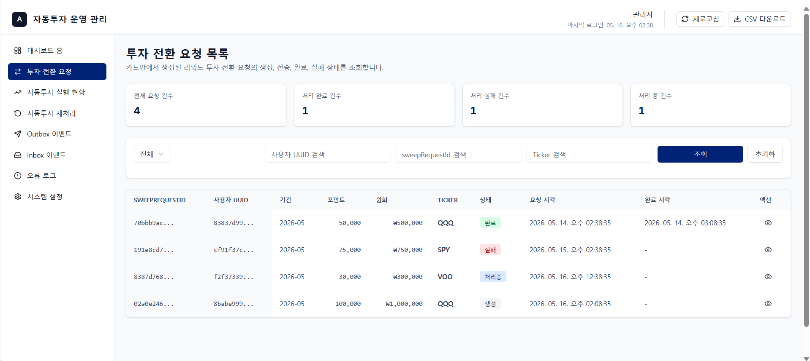
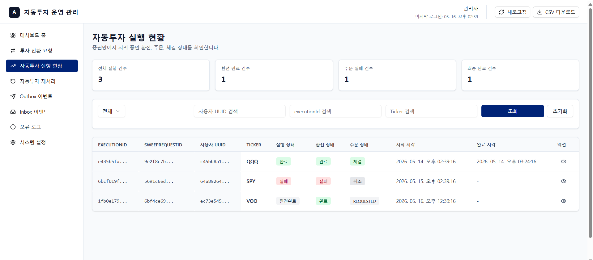
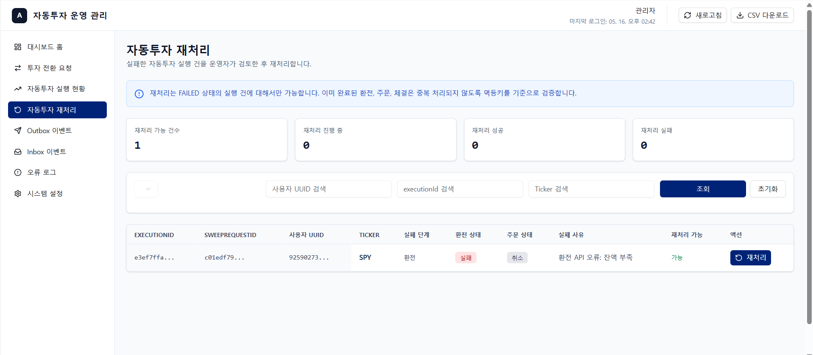
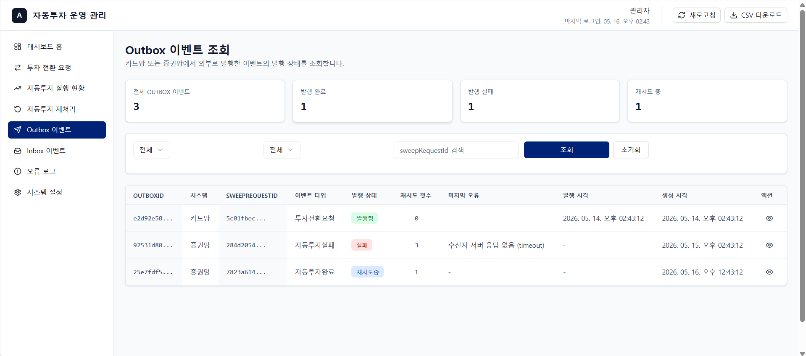
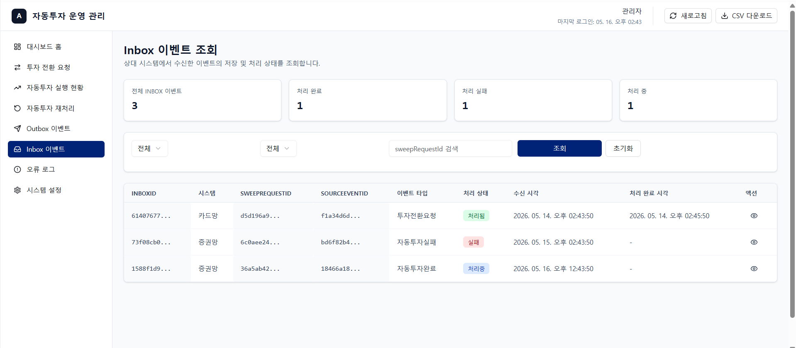

# 📈 자동투자 운영 관리 대시보드

금융권 자동투자 시스템의 운영 상태를 실시간으로 모니터링하고 관리하는 어드민 대시보드입니다.

## 🎯 프로젝트 개요
자동투자 플랫폼의 운영자가 다음을 효율적으로 관리할 수 있도록 설계되었습니다:
- **투자 전환 요청 관리**: 사용자의 투자 전환 요청 상태 추적
- **자동투자 실행 현황**: 환전→주문→체결 6단계 프로세스 모니터링
- **실패 건 재처리**: 실패한 자동투자를 단계별로 재처리
- **이벤트 추적**: Outbox/Inbox 이벤트의 발행 및 처리 상태 조회


## 📋 주요 기능 및 화면

### 1. 대시보드 홈 (KPI 및 차트)
5개의 핵심 KPI와 실시간 처리 상태를 도넛 차트 및 라인 차트로 한눈에 모니터링합니다.


### 2. 투자 전환 요청 관리
사용자의 요청 상태를(PENDING, COMPLETED, FAILED) 필터링하고 상세 내역을 사이드 패널로 확인합니다.


### 3. 자동투자 실행 현황 및 재처리
환전부터 체결까지 6단계 Stepper로 진행 상황을 추적하고, 실패 건은 즉시 재처리할 수 있습니다.



### 4. 이벤트 모니터링
시스템에서 발행된 모든 Outbox 및 Inbox 이벤트를 타임라인 형태로 조회할 수 있습니다. 이 화면을 통해 데이터 일관성을 실시간으로 검증합니다.




## 🏗️ 기술 스택
- **프레임워크**: React 19 + TypeScript
- **스타일링**: Tailwind CSS 4 + shadcn/ui
- **라우팅 & 상태 관리**: Wouter, React Context
- **차트**: Recharts
- **번들러**: Vite

## 🚀 시작하기

### 1. 의존성 설치
```bash
pnpm install
```


### 2. 환경 변수 설정
```bash
cp .env.example .env.local
```

(상세 환경 변수 값은 `DEPLOYMENT.md`를 참고하세요.)

### 3. 개발 서버 실행
```bash
pnpm dev
```

브라우저에서 `http://localhost:3000` 으로 접속합니다.

## 📚 관련 문서 가이드
* 🏗️ **[PROJECT_STRUCTURE.md](./PROJECT_STRUCTURE.md)**: 데이터 모델 및 폴더 구조 가이드
* 🚀 **[DEPLOYMENT.md](./DEPLOYMENT.md)**: 배포, 환경 변수, 트러블슈팅 가이드
* 🎨 **[FRONTEND_GUIDELINE.md](./FRONTEND_GUIDELINE.md)**: 프론트엔드 코드 컨벤션 및 스타일 가이드